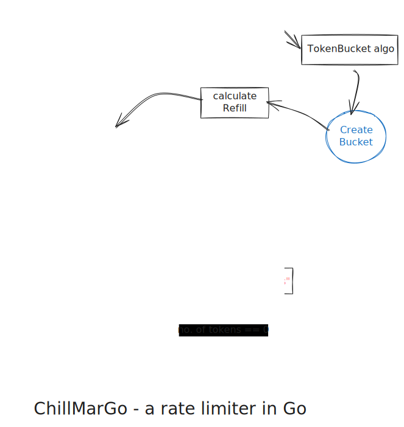

# chillMarGo

> yet another rate limiter yelling at bots and user to chill.

This project called `chillMarGo` is a implementation of classic rate limiter built in Go using the `Token Bucket Algorithm`.

## Project Structure

```
chillMarGO/
├── cmd/
│   └── main.go
├── internal/
│   ├── handlers/
│   │   └── resource.go
│   ├── middleware/
│   │   └── middleware.go
│   ├── rate-limiter/
│   │   ├── rate-limiter.go
│   │   └── rate-limiter_integration_test.go
│   ├── types/
│   │   └── api.go
│   └── utils/
│       └── utils.go
├── LICENSE
└── readme.md
```

## Algorithm Flow



## Setup

```bash
git clone https://github.com/chillMarGO/chillMarGO.git
cd chillMarGO
go mod download
go run cmd/main.go
```

Server runs on `http://localhost:8080`

## Tests

```bash
go test ./... -cover
```

## Usage

```go
l := ratelimiter.NewLimiter(10, 1) // capacity=10, refillRate=1/sec
tokenBucketAlgo := ratelimiter.TokenBucketAlgo(l)
rateLimited := middleware.RateLimiterWrapper(handlers.Resource, tokenBucketAlgo)
http.HandleFunc("/v1/resource", rateLimited)
```

```bash
curl http://localhost:8080/v1/resource
```

## Response

Success (200): `{"success": true, "data": "You will get resource"}`  
Rate Limited (429): `{"success": false, "error": "Too many requests.."}`

## License

MIT - see `LICENSE`.
