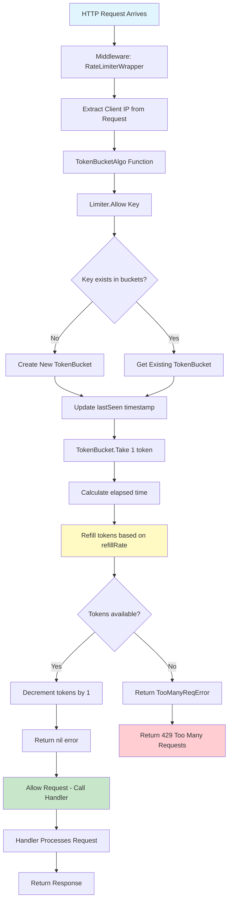
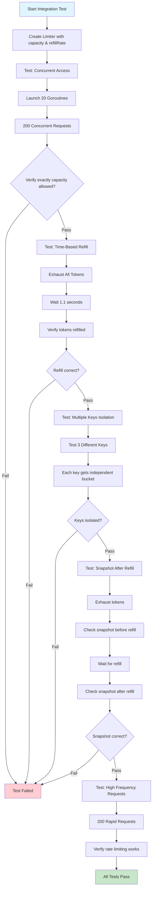

# chillMarGo

> yet another rate limiter yelling at bots and user to chill.

This project called `chillMarGo` is a implementation of classic rate limiter built in Go using the `Token Bucket Algorithm`.

## Token Bucket Algorithm Flow



## Integration Test Flow



## Cloning & Setup

### Prerequisites

- Go 1.25.5 or higher
- Git

### Clone the Repository

```bash
git clone https://github.com/chillMarGO/chillMarGO.git
cd chillMarGO
```

### Install Dependencies

```bash
go mod download
```

### Run the Server

```bash
go run cmd/main.go
```

The server will start on `http://localhost:8080`

### Run Tests

```bash
# Run all tests
go test ./...

# Run with coverage
go test ./... -cover

# Run integration tests only
go test ./internal/rate-limiter/... -v -run Integration

# Run stress tests (may take longer)
go test ./internal/rate-limiter/... -v -run Stress
```

## Usage Examples

### Basic HTTP Server with Rate Limiting

```go
package main

import (
	"log"
	"net/http"
	
	"github.com/chillMarGO/internal/handlers"
	"github.com/chillMarGO/internal/middleware"
	ratelimiter "github.com/chillMarGO/internal/rate-limiter"
)

func main() {
	// Create limiter: capacity=10 tokens, refillRate=1 token/second
	l := ratelimiter.NewLimiter(10, 1)
	
	// Adapt limiter to middleware signature
	tokenBucketAlgo := ratelimiter.TokenBucketAlgo(l)
	
	// Wrap handler with rate limiting middleware
	rateLimited := middleware.RateLimiterWrapper(handlers.Resource, tokenBucketAlgo)
	
	// Register route
	http.HandleFunc("/v1/resource", rateLimited)
	
	log.Fatal(http.ListenAndServe(":8080", nil))
}
```

### Making HTTP Requests to Rate-Limited Endpoint

#### Using cURL

```bash
# First 10 requests will succeed
for i in {1..10}; do
  curl http://localhost:8080/v1/resource
  echo ""
done

# 11th request will be rate limited (429 Too Many Requests)
curl http://localhost:8080/v1/resource
```

#### Using Go HTTP Client

```go
package main

import (
	"fmt"
	"io"
	"net/http"
	"time"
)

func main() {
	client := &http.Client{
		Timeout: 5 * time.Second,
	}
	
	// Make multiple requests
	for i := 1; i <= 12; i++ {
		resp, err := client.Get("http://localhost:8080/v1/resource")
		if err != nil {
			fmt.Printf("Request %d failed: %v\n", i, err)
			continue
		}
		
		body, _ := io.ReadAll(resp.Body)
		fmt.Printf("Request %d: Status=%d, Body=%s\n", i, resp.StatusCode, string(body))
		resp.Body.Close()
		
		// Small delay between requests
		time.Sleep(100 * time.Millisecond)
	}
}
```

### Rate Limit Configuration Examples

```go
// Strict rate limit: 5 requests per minute
limiter := ratelimiter.NewLimiter(5, 1) // 5 tokens, 1 token per 60 seconds

// Moderate rate limit: 100 requests per minute
limiter := ratelimiter.NewLimiter(100, 100) // 100 tokens, 100 tokens per 60 seconds

// Generous rate limit: 1000 requests per minute
limiter := ratelimiter.NewLimiter(1000, 1000) // 1000 tokens, 1000 tokens per 60 seconds
```

## Response Format

### Success Response (200 OK)

```json
{
  "success": true,
  "data": "You will get resource"
}
```

### Rate Limited Response (429 Too Many Requests)

```json
{
  "success": false,
  "error": "Too many requests.."
}
```

## Project Structure

```
chillMarGO/
├── cmd/
│   └── main.go                 # Application entry point
├── internal/
│   ├── handlers/
│   │   └── resource.go         
│   ├── middleware/
│   │   └── middleware.go      
│   ├── rate-limiter/
│   │   ├── rate-limiter.go    # Token bucket implementation
│   │   └── rate-limiter_integration_test.go  # Integration test
│   ├── types/
│   │   └── api.go             # Request/Response types
│   └── utils/
│       └── utils.go            # Utility functions
├── LICENSE
└── readme.md
```

## How It Works

1. **Token Bucket Initialization**: Each client IP gets a token bucket with a fixed capacity and refill rate
2. **Request Arrival**: When a request arrives, the middleware extracts the client IP
3. **Token Check**: The limiter checks if tokens are available in the bucket
4. **Refill Calculation**: Tokens are automatically refilled based on elapsed time and refill rate
5. **Decision**: If tokens available → allow request, else → return 429 error
6. **Isolation**: Each client IP has its own independent token bucket

## License

MIT - see `LICENSE`.
